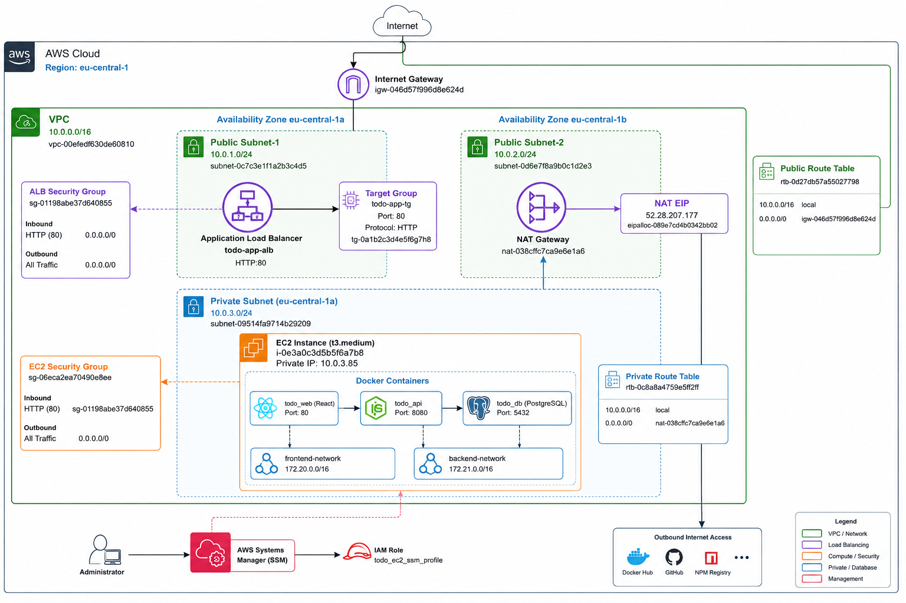
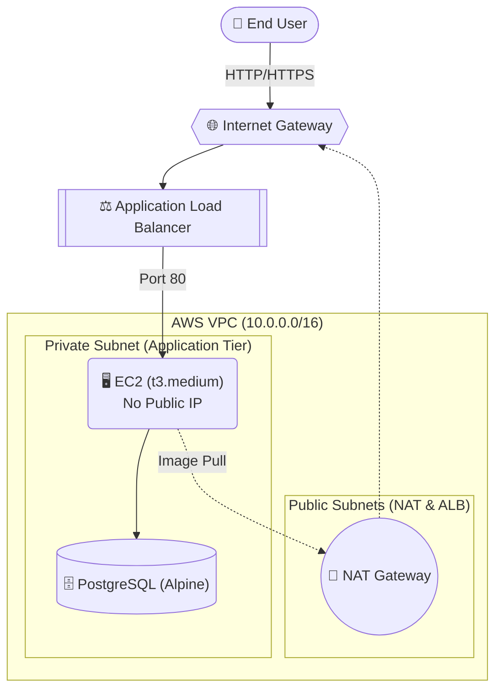
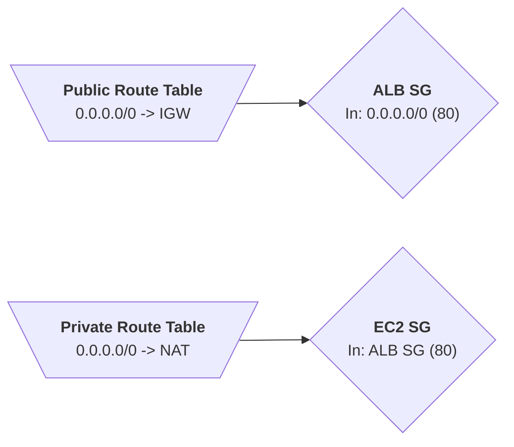
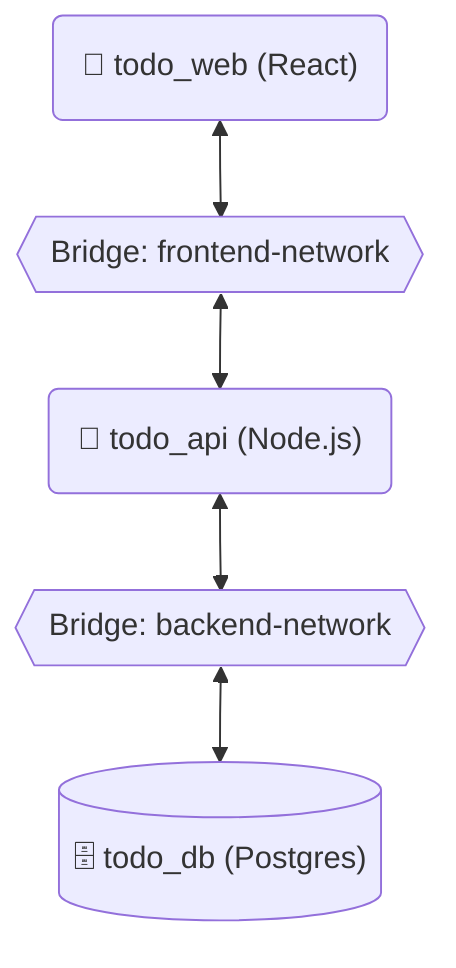

# 🚀 AWS-Native 3-Tier To-Do Application

<div align="center">
  
  
  
  
  
  
</div>

<div align="center">

</div>

## 📑 Table of Contents
1. [Project Overview](#1-project-overview)
2. [Architecture Overview](#2-architecture-overview)
3. [AWS Infrastructure Deep Dive](#3-aws-infrastructure-deep-dive)
4. [Docker Architecture](#4-docker-architecture)
5. [Case Study: Performance Optimization](#5-case-study-performance-optimization)
6. [Deployment Workflow (Terraform)](#6-deployment-workflow)
7. [Installation & Validation](#7-installation--validation)

---

## 1. Project Overview
This project demonstrates the deployment of a highly available, secure, and automated 3-tier web application (React, Node.js, PostgreSQL) on AWS. The entire infrastructure is provisioned using **Terraform (IaC)**, enforcing strict network isolation, Zero-SSH security, and cost-effective resource management.

---

## 2. Architecture Overview



---

## 3. AWS Infrastructure Deep Dive
This infrastructure follows the principle of least privilege and strict network boundaries.

VPC Design: Custom VPC (10.0.0.0/16) spanning multiple Availability Zones.

Public Subnets: Hosts the Application Load Balancer (ALB) and NAT Gateway.

Private Subnet: Houses the EC2 instance running the application payload. Completely cut off from direct internet access.

Systems Manager (SSM): Zero-SSH policy implemented. Access to the EC2 instance is managed strictly via AWS Systems Manager Session Manager using the todo_ec2_ssm_profile IAM role.


---

## 4. Docker Architecture
The application runs on a single EC2 Docker host, but enforces strict logical separation using Docker Bridge Networks.

 - frontend-network: Dedicated network for traffic between the React container and the Node.js API.

 - backend-network: Isolated network connecting the Node.js API to the PostgreSQL 
 database. The React frontend has zero network visibility into the database layer.



---

## 5. Case Study: Performance Optimization
🔴 The Challenge (Memory Exhaustion):
The initial architecture was designed using Microsoft SQL Server (MSSQL 2022). Upon deployment via Terraform to the t3.medium (4GB RAM) EC2 instance, the heavy memory footprint of the MSSQL container starved the Node.js API and React containers. This resulted in continuous CPU throttling, leading to a 503 Service Unavailable error at the ALB layer.

🟢 The Solution (Architectural Pivot):
Instead of vertically scaling the EC2 instance (which incurs higher AWS costs), the database layer was refactored.

Replaced MSSQL with PostgreSQL 15-Alpine, known for its extremely low overhead.

Updated the Node.js API ORM/queries to support PostgreSQL dialects.

Modified the Terraform user_data script to pull the new lightweight images.

Result: The application now runs seamlessly with ~60% less memory utilization, maintaining high availability without increasing cloud infrastructure costs.

---

## 6. Deployment Workflow (Terraform)

The entire infrastructure and application stack is deployed using a zero-touch approach.

- Terraform provisions the VPC, Subnets, ALB, NAT, and Security Groups.

- An EC2 instance is launched into the Private Subnet.

- The user_data script executes upon boot:

  - Updates the OS (Amazon Linux 2).

  - Installs Docker and Docker Compose.

  - Dynamically generates the docker-compose.yml file.

  - Pulls images from Docker Hub (via NAT Gateway) and starts the services.


---


## 7. Installation & Validation
To reproduce this environment in your own AWS account:

```bash
# 1. Clone the repository
git clone [https://github.com/hasiptektas/todo-app-aws.git](https://github.com/hasiptektas/todo-app-aws.git)
cd todo-app-aws/terraform

# 2. Initialize Terraform
terraform init

# 3. Preview infrastructure changes
terraform plan

# 4. Deploy (Provisioning takes ~3-5 minutes)
terraform apply -auto-approve
```

Once deployment is complete, Terraform will output the uygulama_linki (ALB DNS URL).


```bash
# To destroy the infrastructure and prevent AWS billing:
terraform destroy -auto-approve
```

---

## 🛡️ 8. Security Best Practices Demonstrated
 - Private Subnet Deployment for Compute Resources.

 - Zero-SSH Architecture (AWS Systems Manager).

 - Least Privilege Security Group Rules.

 - Docker Network Isolation.

 - Infrastructure as Code (Terraform) for reproducible, immutable infrastructure.

---

Developed by [Hasip Tektaş]